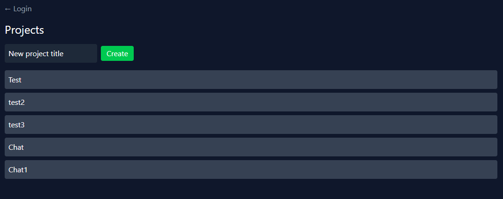
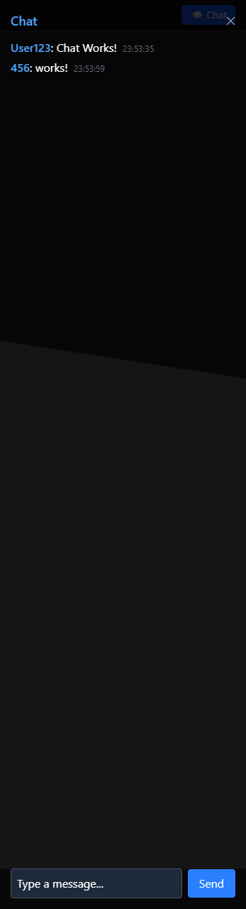

# Clientfe

This project was generated using [Angular CLI](https://github.com/angular/angular-cli) version 20.3.5.

## 🚀 Live Demo
🔗 [Try the App]([https://collab3d.vercel.app](https://3d-app-delta.vercel.app/login)

# 🧱 Real-Time 3D Collaboration App

This project is a **real-time collaborative 3D scene editor** built with **Angular**, **Three.js**, **Node.js**, **Express**, **Socket.IO**, and **MongoDB Atlas**.

Users can:
- Create and view shared projects
- Chat in real time
- Add and remove 3D annotations
- Synchronize camera movement with all connected users
- Change cube color dynamically

---

## 🚀 Features

✅ Real-time chat with Socket.IO  
✅ Live annotation synchronization (add & delete)  
✅ Smooth real-time camera sync  
✅ Shared project list across all users  
✅ MongoDB Atlas cloud database  
✅ Responsive UI built with TailwindCSS  
✅ 3D scene powered by Three.js  

---

## 🧩 Tech Stack

| Category   | Technology |
|-------------|-------------|
| **Frontend** | [Angular 20](https://angular.dev/), [TailwindCSS](https://tailwindcss.com/), [Three.js](https://threejs.org/) |
| **Backend**  | [Node.js](https://nodejs.org/), [Express.js](https://expressjs.com/) |
| **Real-Time** | [Socket.IO](https://socket.io/) |
| **Database** | [MongoDB Atlas](https://www.mongodb.com/atlas/database) |

---

## 🛠️ Installation Guide

### Clone this repository (frontend)
### For backend clone this [repository](https://github.com/MarteX20/server-backend-)

### In both cloned repositories run npm install to install all dependencies 

### Create a .env file inside /server (backend repository) and add:
**PORT=3000
MONGO_URI=mongodb+srv://'username':'password'@'cluster'.mongodb.net/?retryWrites=true&w=majority&appName='your-app-name'**

🌍 MongoDB Atlas Setup

1) Visit [MongoDB Atlas](https://www.mongodb.com/products/platform/atlas-database)
2) Create a free cluster.
3) In Database & Network Access, add a new user with a password.
4) In Database & Network Access, allow access from your IP (0.0.0.0/0 for all).
5) Copy your credentials and paste it into .env as MONGO_URI.

**!!!** ⚠️ Replace 'username', 'password', 'cluster', and 'your-app-name' with your MongoDB Atlas credentials.

### Start the backend server:
npm start

### Start the Angular dev server:
npm start (or 'ng s -o' and wait it will open atomatically in your browser). By default, it runs at: http://localhost:4200

⚡ Real-Time Synchronization

This project uses Socket.IO for live updates:
| Feature     | Description                                          |
| ----------- | ---------------------------------------------------- |
| Chat        | All messages appear instantly for all users          |
| Annotations | Adding/removing annotations is synced in real time   |
| Camera      | Camera rotation/movement is broadcast to all clients |
| Projects    | Project list is shared among all users               |

### 🧪 Testing the App
Open two browser tabs (or two different browsers on your PC).
Open the same project in both.

Try:

**---> Moving the camera  **
**---> Sending a chat message  **
**---> Adding or deleting annotations  **
**---> Changing cube color (currently only on your PC)  **
**---> You should see everything update instantly in both clients.  **

Load personal 3D files will be added soon, stay tuned

## 🖼️ Screenshots

### 🏠 Project List

### 🧱 3D Scene View

### 💬 Real-time Chat

### Login

🧑‍💻 **Author**

**Artem A.**  
Frontend Developer | Web Enthusiast | Star Wars Fan 🚀🪐🌕🌑☄️🛸
   

For more information on using the Angular CLI, including detailed command references, visit the [Angular CLI Overview and Command Reference](https://angular.dev/tools/cli) page.
